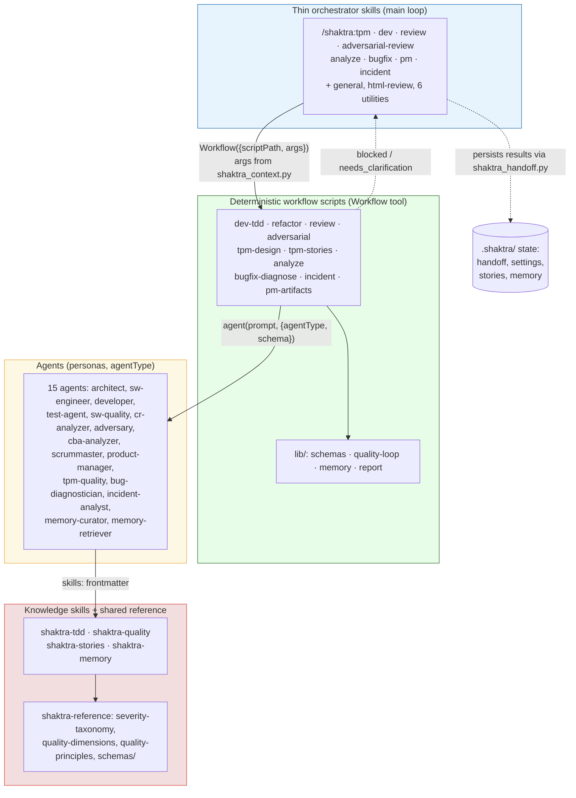

# 3. Layering Architecture

Shaktra 1.x is layered: thin user-invocable skills prepare context and handle
escalations; deterministic workflow scripts own orchestration; agents carry
personas and do the work; knowledge skills and the shared reference layer hold
the quality content. The key design rule is **no content duplication** — every
definition lives in exactly one layer.

**Reading guide:**
- **Skills (blue):** classify intent, run pre-flight via `scripts/shaktra_context.py`, invoke a workflow, present results, and handle escalations with AskUserQuestion. They never orchestrate agents by hand.
- **Workflows (green):** deterministic JS pipelines — real loops, `parallel()` fan-out, schema-validated agent returns. Shared logic lives in `lib/` children (see `workflows/README.md` for the runtime constraints).
- **Agents (yellow):** full personas dispatched via `agentType`; their structured output must satisfy the schema supplied at dispatch.
- **Knowledge + reference (red):** the quality moat — TDD practices, quality checklists, severity taxonomy, YAML schemas. Defined exactly once, loaded through agent `skills:` frontmatter.
- Dashed arrows: escalation back to the user, and deterministic state persistence (`shaktra_handoff.py`, `shaktra_sprint.py`).

**Source:** `dist/shaktra/workflows/README.md`, `dist/shaktra/skills/*/SKILL.md`, `CLAUDE.md` (Component Overview)
