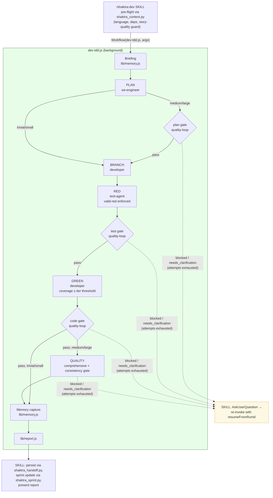

# 4. Dev Pipeline (workflows/dev-tdd.js)

`/shaktra:dev` runs pre-flight in the main loop, then hands execution to the
deterministic `dev-tdd.js` workflow. Quality gates use the single
`lib/quality-loop.js` implementation; escalations return to the skill, which
asks the user and re-invokes with cached agents replaying.

**Notes:** RED is skipped for trivial tier; the comprehensive QUALITY phase runs
for medium/large only (the tier gate matrix lives in `story-tiers.md`).
`refactor.js` follows the same shape with ASSESS → FORTIFY → TRANSFORM → VERIFY.

**Source:** `dist/shaktra/workflows/dev-tdd.js`, `dist/shaktra/skills/shaktra-dev/SKILL.md`
