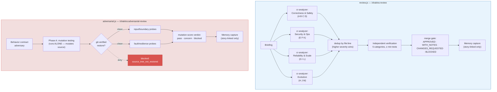

# 5. Review Pipelines (review.js + adversarial.js)

Both review commands run deterministic fan-out pipelines. Findings travel
in-band and the verdict math lives in the script — agents only report evidence.

**Notes:** the four cr-analyzer groups cover all 13 review dimensions; every
failing independent-verification test becomes a P1 finding. Mutation testing
never overlaps the probe phase — the restore check between them is mandatory.

**Source:** `dist/shaktra/workflows/review.js`, `dist/shaktra/workflows/adversarial.js`
