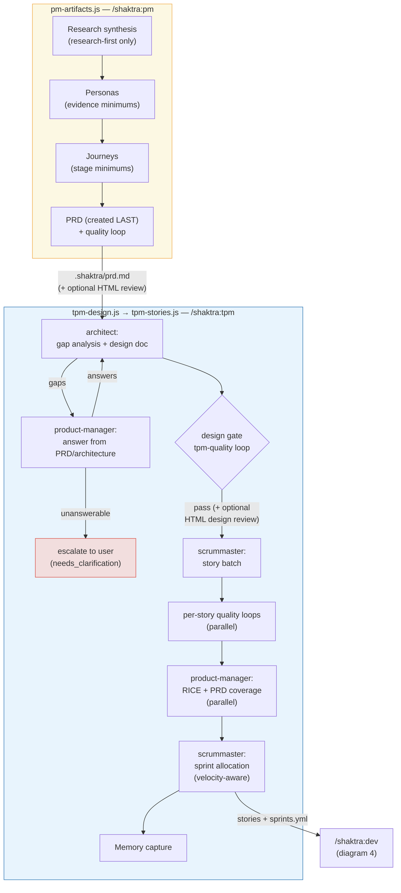

# 6. Planning Pipelines (tpm-design.js, tpm-stories.js, pm-artifacts.js)

Product definition (`/shaktra:pm`) feeds planning (`/shaktra:tpm`). Interactive
triage happens in the main loop; artifact generation is deterministic.

**Notes:** hotfix mode short-circuits to a single trivial-tier story (no quality
loop — a 3-field story has nothing to review). Sprint completion math runs
deterministically in `scripts/shaktra_sprint.py` when dev finishes a story.

**Source:** `dist/shaktra/workflows/tpm-design.js`, `tpm-stories.js`, `pm-artifacts.js`
