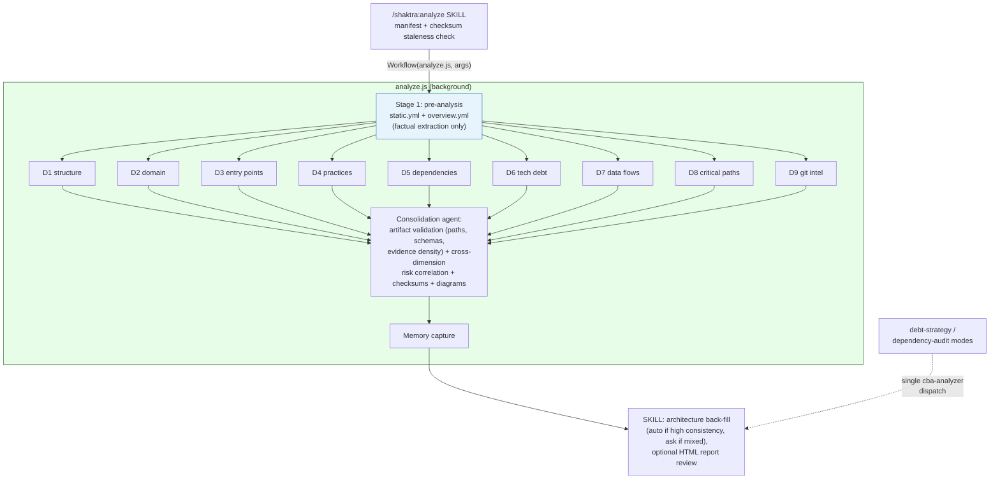

# 7. Analyze Pipeline (workflows/analyze.js)

The single analysis implementation: factual ground truth first, nine parallel
dimensions on top of it, then a consolidation agent that validates artifacts
and computes cross-dimension risk.

**Notes:** targeted and refresh intents pass a dimension subset; checksums map
changed files to stale dimensions (D9 is always stale). Skipped dimensions'
artifacts remain valid — the manifest tracks per-dimension state.

**Source:** `dist/shaktra/workflows/analyze.js`, `dist/shaktra/skills/shaktra-analyze/SKILL.md`
