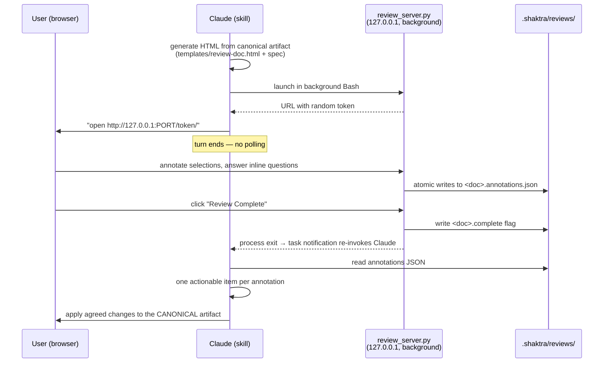

# 8. HTML Review Lifecycle (shaktra-html-review)

Annotatable HTML docs give the user a structured way to review plans, designs,
PRDs, and analysis reports. The HTML always accompanies a canonical
markdown/YAML artifact — never replaces it.

**Notes:** the server binds localhost only and serves exactly one document
under a random URL token; `POST /api/complete` is the only exit path besides
killing the task. Offered from tpm (design), pm (PRD), and analyze (report)
via AskUserQuestion.

**Source:** `dist/shaktra/scripts/review_server.py`, `dist/shaktra/skills/shaktra-html-review/SKILL.md`, `dist/shaktra/templates/review-doc-spec.md`
